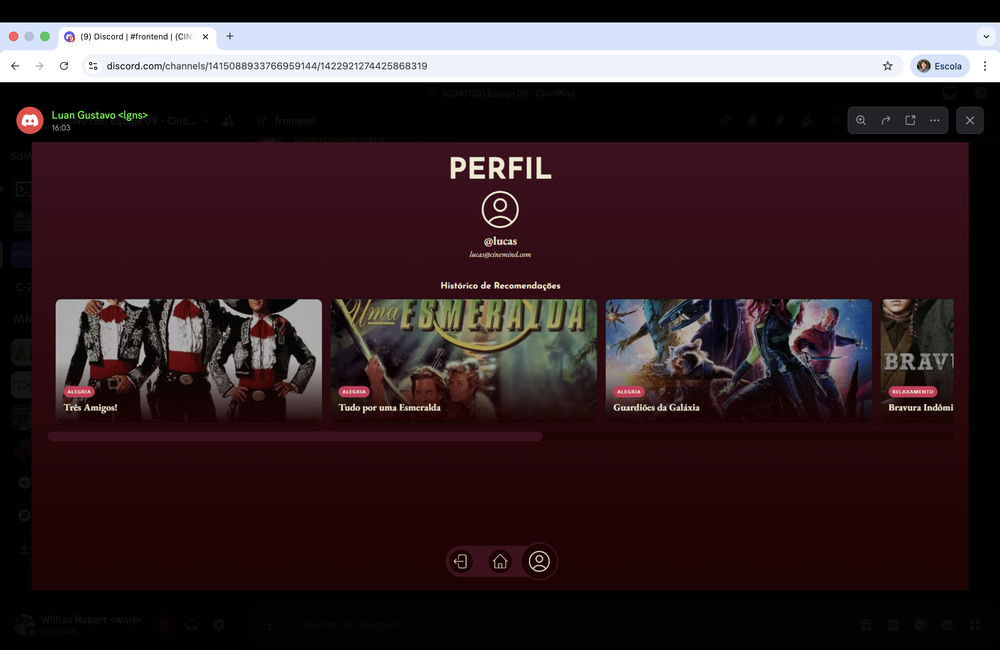

  <h1>CineMind</h1>
  
  

    <strong>Cinema encontra Psicologia.</strong> 
    Descubra filmes que entendem quem você é.
  

  

    
    
    
    
  

   

  

    

---

## 🧠 A Essência

> "Não é apenas sobre o que você assiste. É sobre como você se sente."

O **CineMind** redefine a recomendação de filmes. Esqueça os algoritmos genéricos. Nós combinamos o modelo psicológico **Big Five** com o poder da **Google Gemini AI** para alinhar sugestões cinematográficas com a sua personalidade e o seu humor atual.

  

---

## ✨ Funcionalidades

<table>
  <tr>
    <td width="50%" valign="top">
      <h3>🎯 Traçados com Precisão</h3>
      
Nosso onboarding utiliza um questionário psicológico baseado no <em>Big Five</em> para criar uma impressão digital da sua personalidade.

    </td>
    <td width="50%" valign="top">
       
    </td>
  </tr>
  <tr>
    <td width="50%" valign="top">
      
    </td>
    <td width="50%" valign="top">
      <h3>🎨 Calibragem de Gosto</h3>
      
Cruze seus dados psicológicos com seus gêneros favoritos. Do terror ao documentário, a IA adapta a sugestão ao seu gosto refinado.

    </td>
  </tr>
</table>

### O Ecossistema

* **Autenticação JWT Segura:** Seus dados e seu perfil, protegidos.
* **Recomendações via Gemini AI:** Inteligência Generativa que entende nuances de enredo e emoção.
* **Mood-Based Sorting:** Filmes categorizados por *Alegria*, *Tristeza*, *Tensão*, *Curiosidade* e *Relaxamento*.
* **API Autodocumentada:** Swagger UI e ReDoc integrados via `drf-spectacular`.

---

## 👥 O Time (Cast & Crew)

Desenvolvido durante a cadeira de **Desenvolvimento de Software** (CIN0136).

| Membro | GitHub | Papel Principal |
| :--- | :---: | :--- |
| **Eduardo Henrique** | [@ed-henri](https://github.com/ed-henri) | Fullstack Dev |
| **Felipe Mulato** | [@FelipeMulato](https://github.com/FelipeMulato) | AI Integration |
| **Jonas Manoel** | [@jmbl2-svg](https://github.com/jmbl2-svg) | Backend Arch |
| **João Victor Lopes*** | [@jvlopess](https://github.com/jvlopess) | Frontend Lead |
| **Luan Gustavo** | [@lgns-cin](https://github.com/lgns-cin) | UI/UX Design |
| **Matheus Braglia** | [@mbcv-dev](https://github.com/mbcv-dev) | QA & Testing |
| **Willian Rupert** | [@willianrupert](https://github.com/willianrupert) | DevOps |
| *Iury Mikael*** | [@LugiaKB](https://github.com/LugiaKB) | *Legacy Contributor* |

<small>* João Victor assumiu a posição de Iury Mikael após o evento de Job Rotation.</small>

---

## 🚀 Começando

Para rodar o CineMind localmente, consulte nossas documentações dedicadas:

&nbsp;&nbsp;&nbsp;&nbsp;

 

  CineMind © 2025. Construído com ❤️ no CIn-UFPE.

