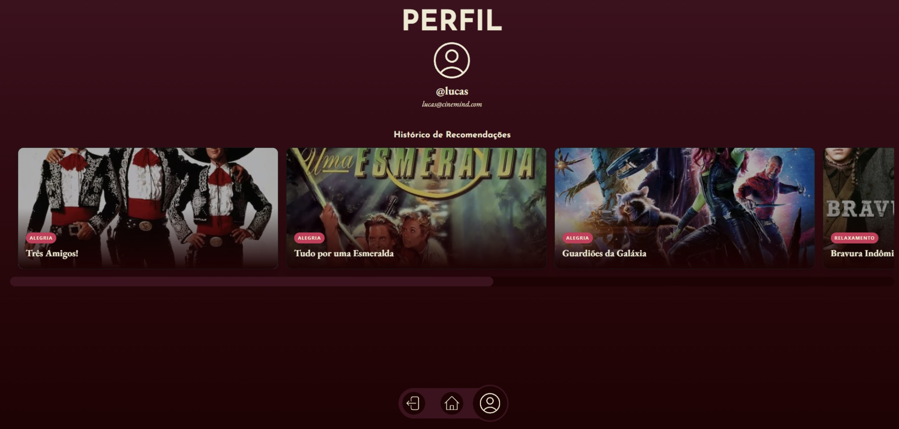
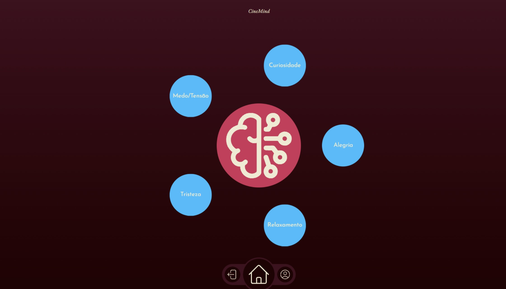
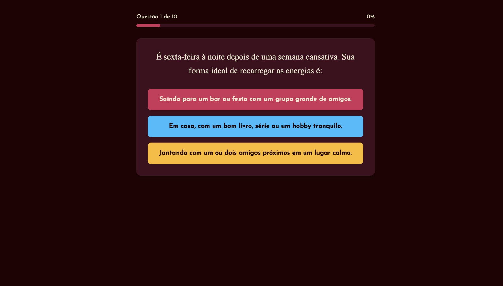
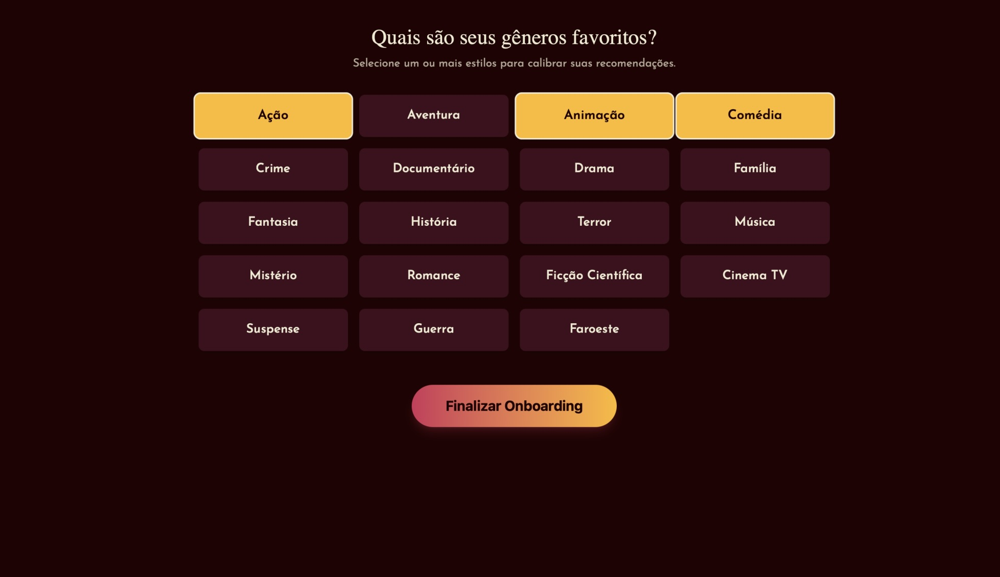

# <div align="center">  
### <sub>Cinema encontra Psicologia. Entenda-se através dos filmes.</sub>
</div>

<div align="center">



</div>

---

# 🌌 Sobre o Projeto

> **“Não é apenas sobre o que você assiste.  
> É sobre como você se sente.”**

O **CineMind** é uma plataforma inovadora que combina **Psicologia**, **IA Generativa** e **Cinema** para criar recomendações cinematográficas verdadeiramente pessoais.

Ao invés de sugestões genéricas, o CineMind utiliza seu perfil psicológico (**Big Five**) e humor atual para encontrar **filmes que ressoam emocionalmente com você**.

---

# 📌 Navegação Rápida

<div align="center">

<a href="#funcionalidades">

</a>
&nbsp;
<a href="#tecnologias">

</a>
&nbsp;
<a href="#arquitetura">

</a>
&nbsp;
<a href="#equipe">

</a>

</div>

---

# 🧠 A Essência

<div align="center">
  
</div>

O CineMind redefine recomendação de filmes ao transformar **traços de personalidade**, **preferências de gênero** e **estados emocionais** em **recomendações sensíveis ao contexto**.  
Cada sugestão é guiada por nuances psicológicas — não só pelo histórico do que você assistiu.

---

# ✨ Funcionalidades

<table>
  <tr>
    <td width="50%" valign="top">
      <h3>🎯 Impressão Digital Psicológica</h3>
      <p>Durante o onboarding, você responde a um questionário baseado no <strong>Big Five</strong> (OCEAN), permitindo que a plataforma modele seu perfil psicológico com precisão.</p>
    </td>
    <td width="50%" valign="top">
       
    </td>
  </tr>
  <tr>
    <td width="50%" valign="top">
      
    </td>
    <td width="50%" valign="top">
      <h3>🎨 Afinidade de Estilo</h3>
      <p>A plataforma cruza seu perfil psicológico com seus gêneros favoritos, producendo recomendações sob medida para seu gosto — de Sci-fi ao Documentário.</p>
    </td>
  </tr>
</table>

---

# 🌡️ Sistema de Humor (Mood-Based Sorting)

O CineMind interpreta emoções e organiza as sugestões em:

- **🟡 Alegria**
- **🔵 Tristeza**
- **🔴 Tensão**
- **🟢 Curiosidade**
- **🟣 Relaxamento**

Cada filme é ponderado pela IA com base na experiência emocional que proporciona.

---

# 🛠️ Tecnologias  
<div id="tecnologias"></div>

<div align="center">

| Área | Tecnologia |
|------|------------|
| **Frontend** | React, Hooks, Context API, Axios |
| **Backend**  | Django REST Framework, Django ORM |
| **IA** | Google Gemini AI (modelos generativos + embeddings) |
| **Infra & Segurança** | JWT Auth, Docker, Swagger UI, ReDoc |
| **Banco de Dados** | PostgreSQL |

</div>

---

# 🏛️ Arquitetura  
<div id="arquitetura"></div>

<div align="center">

```mermaid
flowchart LR
    A[Usuário] --> B[Frontend React]
    B --> C[API Django REST]
    C --> D[(PostgreSQL)]
    C --> E[Integração com Gemini AI]
    E --> F[(Processamento Semântico)]